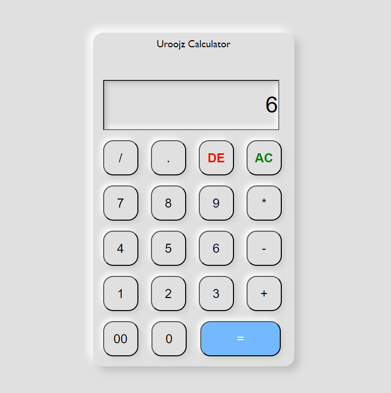

# JavaScript Mini Projects

Welcome to the **JavaScript Mini Projects** repository! This project showcases various mini-projects built using JavaScript, HTML, and CSS. Each project is designed to help you learn and practice different aspects of web development.


## Introduction

JavaScript is a versatile and powerful programming language used for creating interactive web pages, server-side applications, and much more. Its dynamic nature makes it a favorite among developers for building engaging and user-friendly web experiences.

Learn more about JavaScript on [MDN Web Docs](https://developer.mozilla.org/en-US/docs/Web/JavaScript).

## Projects

### Project 1: Calculator

The "Calculator" folder contains a Neomorphism Calculatorn with its associated file.

### Files and Folders

- **`index.html`**: The main HTML file for the to-do list application.

- **[View Code](https://github.com/Urooj-Islam-Khan/JS-Mini-Project/blob/main/Calculator/index.html)**
- **[Live Demo](https://Urooj-Islam-Khan.github.io/JS-Mini-Project/Calculator/index.html)**




### Project 2: To-Do List

A to-do list application to keep track of tasks.

## To-Do List

The "To-Do List" folder contains a simple to-do list application with its associated files.

### Files and Folders

- **`index.html`**: The main HTML file for the to-do list application.
- **`style.css`**: The CSS file that styles the to-do list application.
- **`script.js`**: The JavaScript file that adds functionality to the to-do list application.
- **`images/`**: A folder containing images used in the application.

### View and Live Demo

- **[View Code](https://github.com/Urooj-Islam-Khan/JS-Mini-Project/blob/main/To-Do%20List/index.html)**
- **[Live Demo](https://Urooj-Islam-Khan.github.io/JS-Mini-Project/To-Do%20List/index.html)**

### Screenshot


### Folder Structure

## Instructions

To run these projects locally, follow these steps:

1. **Clone the Repository**
   ```bash
   git clone https://github.com/username/JS-Mini-Project.git
   
## Contributing
We welcome contributions to improve and expand the projects! If you'd like to contribute, please read our contributing guide and follow the steps outlined.

## Contact
Feel free to reach out with any questions or feedback:

**Email:** uroojislamkhan124@gmail.com

**Instagram**: @the_coding_room

**LinkedIn:** Urooj Islam

GitHub: Urooj-Islam-Khan
